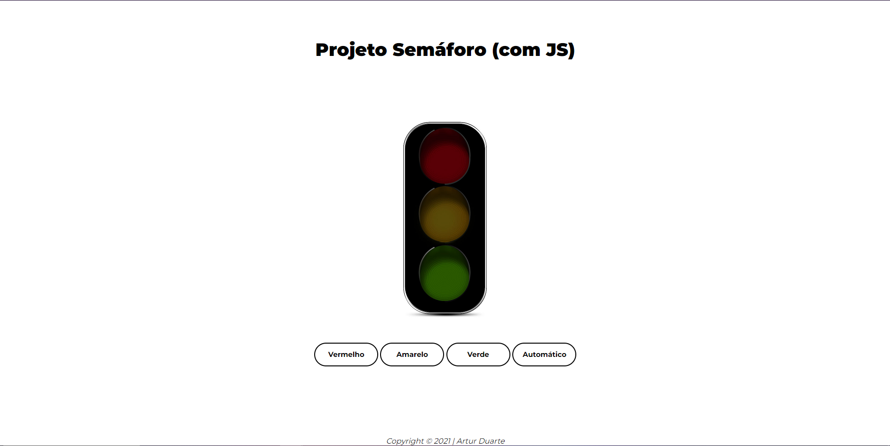

# Calculadora de IMC 🏋



<p align="center">
  
  
  
</p>

🇺🇸 Do not speak Portuguese? [Click here](README.md) to view the English version.

## 🚀 Sobre o Projeto

A Calculadora de IMC é uma aplicação web simples, mas eficaz, que demonstra a aplicação prática de HTML, CSS e JavaScript. Ela permite aos usuários calcular o seu Índice de Massa Corporal (IMC) e classificar o resultado de acordo com os padrões de saúde estabelecidos.

## 🛠️ Tecnologias Utilizadas

- HTML
- CSS
- JavaScript

## ⚙️ Instalação e Uso

Para instalar e usar este projeto, siga estes passos:

1. Clone este repositório na sua máquina local
```bash
git clone https://github.com/artur-duart/bmi-calculator
```
2. Navegue até a pasta principal do projeto
```bash
cd bmi-calculator
```
3. Abra o arquivo `index.html` no seu navegador

Agora você pode acessar o projeto no seu navegador.

## 🤝 Contribuindo

Contribuições são sempre bem-vindas! Se você tiver alguma sugestão ou correção, sinta-se à vontade para abrir uma issue ou enviar um pull request.

## 📝 Licença

Este projeto está licenciado sob a Licença MIT. Veja o arquivo [LICENSE](LICENSE) para mais detalhes.

---

Feito com 💜 por <a href="https://www.linkedin.com/in/artur-duart/">Artur Duarte</a> :wave:"# Calculadora de IMC 🏋


<p align="center">
  
  
  
</p>


🇺🇸 Do not speak Portuguese? [Click here](README.md) to view the English version.

## 🚀 Sobre o Projeto

O Simulador de Semáforo é uma aplicação web simples, mas eficaz, que demonstra a aplicação prática de HTML, CSS e JavaScript. Ela permite ao usuário simular o funcionamento de um semáforo.

## 🛠️ Tecnologias Utilizadas

- HTML
- CSS
- JavaScript

## ⚙️ Instalação e Uso

Para instalar e usar este projeto, siga estes passos:

1. Clone este repositório na sua máquina local
```bash
git clone https://github.com/artur-duart/traffic-light-simulator
```
2. Navegue até a pasta principal do projeto
```bash
cd traffic-light-simulator
```
3. Abra o arquivo `index.html` no seu navegador

Agora você pode acessar o projeto no seu navegador.

## 🤝 Contribuindo

Contribuições são sempre bem-vindas! Se você tiver alguma sugestão ou correção, sinta-se à vontade para abrir uma issue ou enviar um pull request.

## 📝 Licença

Este projeto está licenciado sob a Licença MIT. Veja o arquivo [LICENSE](LICENSE) para mais detalhes.

---

Feito com 💜 por <a href="https://www.linkedin.com/in/artur-duart/">Artur Duarte</a> :wave:"
